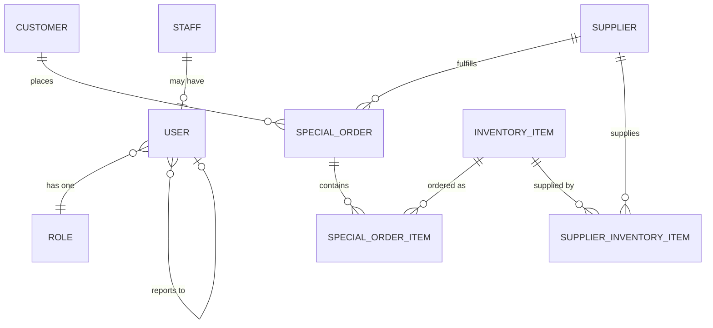
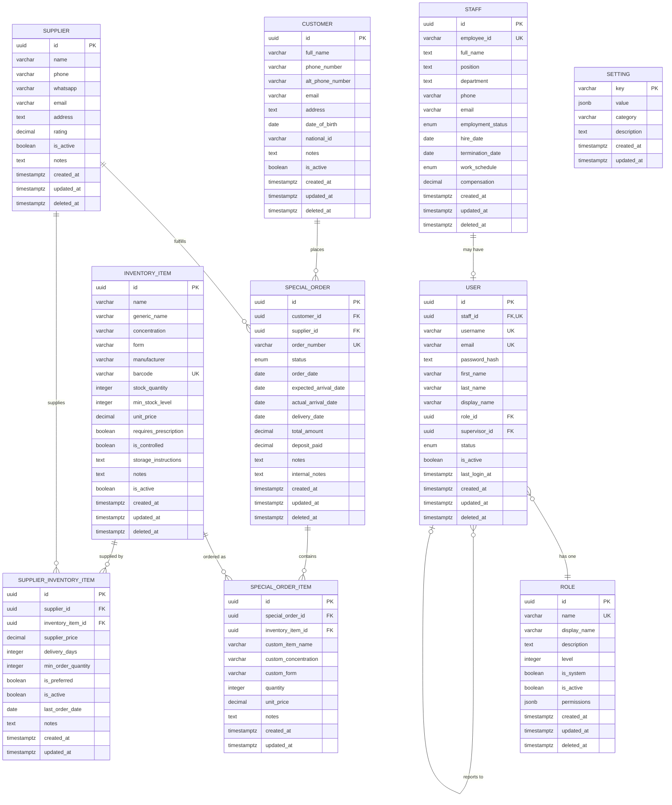

# Pharmacy Management System - Entity Model

## Overview

This document describes the complete entity model for the pharmacy management system, including:

1. **User Management**: Staff, Users, and Roles
2. **Customer Management**: Customer records
3. **Inventory Management**: Medicine catalog
4. **Order Management**: Special orders and order items
5. **Supplier Management**: Suppliers and their inventory relationships
6. **System Configuration**: Application settings

## High-Level Entity Relationship Diagram



## Table of Contents

1. [User Management Entities](#user-management-entities)
2. [Customer Management](#customer-management)
3. [Inventory Management](#inventory-management)
4. [Order Management](#order-management)
5. [Supplier Management](#supplier-management)
6. [System Configuration](#system-configuration)
7. [Database Schema](#database-schema)
8. [Relationships](#relationships)

---

## User Management Entities

### Staff Entity

Represents all actively working employees in the pharmacy.

**Purpose**: Track all employees regardless of app access

**Key Fields**:

- `id` (UUID) - Primary key
- `employee_id` (VARCHAR(50), UNIQUE) - Employee badge number
- `full_name` (TEXT) - Employee's full name
- `position` (TEXT) - Job title
- `department` (TEXT) - Department
- `employment_status` (ENUM) - Active, OnLeave, Terminated
- `work_schedule` (ENUM) - FullTime, PartTime, Contract
- `hire_date` (DATE) - Employment start date
- `termination_date` (DATE, nullable) - Employment end date

**Relationships**:

- One-to-one with User (optional)

### User Entity

Represents staff members who have been granted app access.

**Purpose**: Provide app authentication and authorization

**Key Fields**:

- `id` (UUID) - Primary key
- `staff_id` (UUID, UNIQUE) - Foreign key to Staff (required)
- `username` (VARCHAR(100), UNIQUE) - Login username
- `email` (VARCHAR(255), UNIQUE) - Login email
- `password_hash` (TEXT) - Hashed password
- `role_id` (UUID) - Foreign key to Role (required)
- `status` (ENUM) - Active, Inactive, Suspended, PendingVerification
- `is_active` (BOOLEAN) - Can login flag
- `supervisor_id` (UUID, nullable) - Foreign key to User

**Relationships**:

- Many-to-one with Staff (required)
- Many-to-one with Role (required)
- Self-referential (supervisor)

### Role Entity

Represents user roles and permissions.

**Purpose**: Define user permissions and access control

**Key Fields**:

- `id` (UUID) - Primary key
- `name` (VARCHAR(50), UNIQUE) - Role name (e.g., "admin")
- `display_name` (VARCHAR(100)) - Human-readable name
- `level` (INTEGER) - Permission level (higher = more permissions)
- `permissions` (JSONB) - Array of permissions
- `is_system` (BOOLEAN) - System role (cannot be deleted)
- `is_active` (BOOLEAN) - Role is active

**Relationships**:

- One-to-many with User

---

## Customer Management

### Customer Entity

Represents pharmacy customers.

**Purpose**: Maintain customer records for orders and communication

**Key Fields**:

- `id` (UUID) - Primary key
- `full_name` (VARCHAR(200)) - Customer's full name
- `phone_number` (VARCHAR(20)) - Primary phone
- `alt_phone_number` (VARCHAR(20), nullable) - Alternative phone
- `email` (VARCHAR(255), nullable) - Email address
- `address` (TEXT, nullable) - Physical address
- `date_of_birth` (DATE, nullable) - For age verification
- `national_id` (VARCHAR(50), nullable) - ID or insurance number
- `is_active` (BOOLEAN) - Customer is active

**Relationships**:

- One-to-many with SpecialOrder

---

## Inventory Management

### Inventory Item Entity

Represents the medicine catalog.

**Purpose**: Central medicine inventory with stock management

**Key Fields**:

- `id` (UUID) - Primary key
- `name` (VARCHAR(200)) - Medicine name
- `generic_name` (VARCHAR(200), nullable) - Generic/scientific name
- `concentration` (VARCHAR(50)) - Strength (e.g., "500mg")
- `form` (VARCHAR(50)) - Dosage form (e.g., "tablet")
- `manufacturer` (VARCHAR(200), nullable) - Manufacturer name
- `barcode` (VARCHAR(100), nullable, UNIQUE) - Barcode/SKU
- `stock_quantity` (INTEGER) - Current stock
- `min_stock_level` (INTEGER) - Minimum stock for alerts
- `unit_price` (DECIMAL(10,2)) - Unit price
- `requires_prescription` (BOOLEAN) - Prescription required
- `is_controlled` (BOOLEAN) - Controlled substance
- `is_active` (BOOLEAN) - Active in catalog

**Relationships**:

- One-to-many with SpecialOrderItem
- Many-to-many with Supplier (through SupplierInventoryItem)

---

## Order Management

### Special Order Entity

Represents special medicine orders from customers.

**Purpose**: Track special orders (not regular pharmacy sales)

**Key Fields**:

- `id` (UUID) - Primary key
- `customer_id` (UUID) - Foreign key to Customer (required)
- `supplier_id` (UUID, nullable) - Foreign key to Supplier
- `order_number` (VARCHAR(50), UNIQUE) - Human-readable order number
- `status` (ENUM) - Pending, Ordered, Arrived, ReadyForPickup, Delivered, Cancelled
- `order_date` (DATE) - Order date
- `expected_arrival_date` (DATE, nullable) - Expected arrival
- `actual_arrival_date` (DATE, nullable) - Actual arrival
- `delivery_date` (DATE, nullable) - Delivery/pickup date
- `total_amount` (DECIMAL(10,2)) - Total order amount
- `deposit_paid` (DECIMAL(10,2), nullable) - Deposit amount

**Relationships**:

- Many-to-one with Customer (required)
- Many-to-one with Supplier (optional)
- One-to-many with SpecialOrderItem

### Special Order Item Entity

Junction table linking orders to medicines.

**Purpose**: Order line items with quantity and pricing

**Key Fields**:

- `id` (UUID) - Primary key
- `special_order_id` (UUID) - Foreign key to SpecialOrder (required)
- `inventory_item_id` (UUID, nullable) - Foreign key to InventoryItem
- `custom_item_name` (VARCHAR(200), nullable) - Custom item name
- `custom_concentration` (VARCHAR(50), nullable) - Custom concentration
- `custom_form` (VARCHAR(50), nullable) - Custom form
- `quantity` (INTEGER) - Quantity ordered
- `unit_price` (DECIMAL(10,2)) - Price at time of order

**Calculated Fields** (not stored, computed on-demand):

- `subtotal` - Calculated as quantity × unit_price

**Relationships**:

- Many-to-one with SpecialOrder (required)
- Many-to-one with InventoryItem (optional, for custom items)

**Normalization Notes**:

- Removed redundant `subtotal` field (violates 3NF - can be calculated)
- Subtotal is now computed dynamically in the DTO layer
- This improves data integrity and reduces storage

---

## Supplier Management

### Supplier Entity

Represents medicine suppliers.

**Purpose**: Track supplier information and performance

**Key Fields**:

- `id` (UUID) - Primary key
- `name` (VARCHAR(200)) - Supplier name
- `phone` (VARCHAR(20)) - Contact phone
- `whatsapp` (VARCHAR(20), nullable) - WhatsApp number
- `email` (VARCHAR(255), nullable) - Email address
- `address` (TEXT, nullable) - Physical address
- `rating` (DECIMAL(2,1)) - Supplier rating (1-5)
- `is_active` (BOOLEAN) - Supplier is active

**Calculated Fields** (not stored, computed on-demand):

- `total_orders` - Count from special_orders table
- `avg_delivery_days` - Average from supplier_inventory_items table
- `common_medicines` - List from supplier_inventory_items table

**Relationships**:

- One-to-many with SpecialOrder
- Many-to-many with InventoryItem (through SupplierInventoryItem)

**Normalization Notes**:

- Removed redundant `total_orders` field (violates 3NF - can be counted)
- Removed redundant `avg_delivery_days` field (duplicates supplier_inventory_items data)
- Removed redundant `common_medicines` JSONB field (duplicates supplier_inventory_items data)
- All calculated fields are now computed dynamically by the service layer

### Supplier Inventory Item Entity

Junction table for supplier-medicine relationships.

**Purpose**: Track which suppliers provide which medicines with pricing

**Key Fields**:

- `id` (UUID) - Primary key
- `supplier_id` (UUID) - Foreign key to Supplier (required)
- `inventory_item_id` (UUID) - Foreign key to InventoryItem (required)
- `supplier_price` (DECIMAL(10,2)) - Supplier's price
- `delivery_days` (INTEGER) - Delivery time in days
- `min_order_quantity` (INTEGER, nullable) - Minimum order quantity
- `is_preferred` (BOOLEAN) - Preferred supplier for this item
- `is_active` (BOOLEAN) - Relationship is active
- `last_order_date` (DATE, nullable) - Last order date

**Relationships**:

- Many-to-one with Supplier (required)
- Many-to-one with InventoryItem (required)

---

## System Configuration

### Setting Entity

Represents application settings as key-value pairs.

**Purpose**: Store application configuration

**Key Fields**:

- `key` (VARCHAR(100)) - Primary key, setting key
- `value` (JSONB) - Setting value (flexible type)
- `category` (VARCHAR(50), nullable) - Setting category
- `description` (TEXT, nullable) - Setting description

**Relationships**: None

---

## Database Schema

### Complete Entity Relationship Diagram



### PostgreSQL-Specific Optimizations

#### Native Data Types

1. **UUID Type** - All ID fields use PostgreSQL native UUID
2. **ENUM Types** - Status fields use PostgreSQL ENUM
3. **TIMESTAMPTZ** - All datetime fields with timezone
4. **JSONB** - Binary JSON for flexible data
5. **NUMERIC** - Precise decimal for financial data

#### ENUM Definitions

```sql
CREATE TYPE employment_status AS ENUM ('active', 'on_leave', 'terminated');
CREATE TYPE work_schedule AS ENUM ('full_time', 'part_time', 'contract');
CREATE TYPE user_status AS ENUM ('active', 'inactive', 'suspended', 'pending_verification');
CREATE TYPE special_order_status AS ENUM ('pending', 'ordered', 'arrived', 'ready_for_pickup', 'delivered', 'cancelled');
```

---

## Relationships

### User Management

```
Staff (1) ←→ (0..1) User
User (N) ←→ (1) Role
User (N) ←→ (0..1) User (Supervisor)
```

### Order Management

```
Customer (1) ←→ (N) SpecialOrder
Supplier (1) ←→ (N) SpecialOrder
SpecialOrder (1) ←→ (N) SpecialOrderItem
InventoryItem (1) ←→ (N) SpecialOrderItem
```

### Supplier-Inventory Relationship

```
Supplier (N) ←→ (N) InventoryItem (through SupplierInventoryItem)
```

---

## Key Features

### 1. Normalized Data Structure

- No data duplication
- Reusable customer records
- Centralized medicine catalog
- Supplier-medicine relationships tracked separately

### 2. Flexible Order System

- Support for catalog items
- Support for custom items (not in catalog)
- Track order lifecycle from pending to delivered
- Financial tracking (deposits, totals)

### 3. Supplier Management

- Many-to-many relationship with medicines
- Track pricing per supplier per medicine
- Track delivery times and preferences
- Historical order tracking

### 4. Audit Trail

- All tables have created_at/updated_at timestamps
- created_by/updated_by fields for user tracking
- Soft deletion (deleted_at) preserves history
- Timezone-aware timestamps

### 5. Stock Management

- Track current stock levels
- Minimum stock alerts
- Barcode support
- Prescription and controlled substance flags

### 6. Scalability

- Designed for future expansion
- Can add regular pharmacy orders later
- Flexible permission system
- Extensible through JSONB fields

---

## Use Cases

### Scenario 1: Customer Places Special Order

1. Customer record exists or is created
2. Special order is created with customer_id
3. Order items are added (from catalog or custom)
4. Supplier is assigned (optional)
5. Order progresses through statuses
6. Stock is updated when order arrives

### Scenario 2: Finding Best Supplier for Medicine

1. Query SupplierInventoryItem for medicine
2. Filter by is_active and is_preferred
3. Sort by supplier_price and delivery_days
4. Consider supplier rating
5. Select optimal supplier

### Scenario 3: Stock Alert

1. Query InventoryItem where stock_quantity < min_stock_level
2. Find preferred suppliers for low-stock items
3. Generate purchase recommendations
4. Create special orders to restock

### Scenario 4: Customer Order History

1. Query SpecialOrder by customer_id
2. Join with SpecialOrderItem
3. Join with InventoryItem for details
4. Display complete order history

---

## Database Queries

### Get Active Special Orders with Customer Info

```sql
SELECT so.*, c.full_name, c.phone_number
FROM special_orders so
INNER JOIN customers c ON so.customer_id = c.id
WHERE so.status IN ('pending', 'ordered', 'arrived', 'ready_for_pickup')
AND so.deleted_at IS NULL
AND c.deleted_at IS NULL
ORDER BY so.order_date DESC;
```

### Get Order Details with Items

```sql
SELECT
    so.order_number,
    so.status,
    so.total_amount,
    soi.quantity,
    soi.unit_price,
    soi.subtotal,
    COALESCE(ii.name, soi.custom_item_name) as item_name,
    COALESCE(ii.concentration, soi.custom_concentration) as concentration
FROM special_orders so
INNER JOIN special_order_items soi ON so.id = soi.special_order_id
LEFT JOIN inventory_items ii ON soi.inventory_item_id = ii.id
WHERE so.id = 'order-uuid';
```

### Find Suppliers for Medicine

```sql
SELECT
    s.name,
    s.phone,
    sii.supplier_price,
    sii.delivery_days,
    sii.is_preferred,
    s.rating
FROM supplier_inventory_items sii
INNER JOIN suppliers s ON sii.supplier_id = s.id
INNER JOIN inventory_items ii ON sii.inventory_item_id = ii.id
WHERE ii.id = 'medicine-uuid'
AND sii.is_active = true
AND s.deleted_at IS NULL
ORDER BY sii.is_preferred DESC, s.rating DESC, sii.supplier_price ASC;
```

### Low Stock Alert

```sql
SELECT
    ii.name,
    ii.concentration,
    ii.form,
    ii.stock_quantity,
    ii.min_stock_level,
    (ii.min_stock_level - ii.stock_quantity) as shortage
FROM inventory_items ii
WHERE ii.stock_quantity < ii.min_stock_level
AND ii.is_active = true
AND ii.deleted_at IS NULL
ORDER BY shortage DESC;
```

---

## Implementation Notes

### Soft Deletion

- Always check `deleted_at IS NULL` in queries
- Use partial indexes: `WHERE deleted_at IS NULL`
- Cascade soft deletes appropriately

### Timezone Handling

- Store all timestamps in UTC
- Convert to user timezone for display
- Use DateTimeWithTimeZone type

### Audit Trail

- Set created_by/updated_by on all operations
- Auto-update updated_at timestamp
- Preserve history through soft deletion

### Financial Data

- Use DECIMAL for all monetary values
- Store prices at time of order (historical pricing)
- Calculate subtotals automatically

### Stock Management

- Update stock when orders arrive
- Check stock levels before creating orders
- Generate alerts for low stock

### Supplier Selection

- Consider multiple factors: price, delivery time, rating
- Support preferred suppliers per medicine
- Track historical performance

---

## Migration Strategy

### Phase 1: Create Base Tables

1. Create ENUM types
2. Create Staff, User, Role tables
3. Create Customer, InventoryItem, Supplier tables
4. Create Setting table

### Phase 2: Create Relationship Tables

1. Create SpecialOrder table
2. Create SpecialOrderItem table
3. Create SupplierInventoryItem table

### Phase 3: Create Indexes

1. Primary key indexes (automatic)
2. Foreign key indexes
3. Unique constraint indexes
4. Performance indexes
5. Partial indexes for soft deletes
6. GIN indexes for JSONB fields

### Phase 4: Data Migration

1. Migrate existing IndexedDB data
2. Transform old "orders" to "special_orders"
3. Extract customer data from orders
4. Create inventory items from order medicines
5. Migrate supplier data
6. Create supplier-inventory relationships

---

## Future Enhancements

### Regular Pharmacy Orders

- Add `pharmacy_orders` table for regular sales
- Reuse `customers` and `inventory_items` tables
- Track daily sales and revenue

### Purchase Orders

- Add `purchase_orders` table
- Link to suppliers and inventory items
- Track incoming stock

### Prescription Management

- Add `prescriptions` table
- Link to customers and doctors
- Track refills and expiration

### Reporting

- Sales reports
- Inventory reports
- Supplier performance reports
- Customer analytics

---

## Conclusion

This entity model provides a solid foundation for a pharmacy management system with:

- ✅ Normalized data structure
- ✅ Flexible order management
- ✅ Comprehensive supplier tracking
- ✅ Stock management capabilities
- ✅ Complete audit trail
- ✅ Scalability for future features
- ✅ PostgreSQL-optimized design
- ✅ Type-safe implementation with SeaORM
